# Reading-notes
this website is to submit the pre work tasks for the advanced course of java - asac
## Code 102 - Intro to Software Development
## Code 201 - Foundations of Software Development
## Code 301 - Intermediate Software Development
## Code 401 - Advanced Software Development

**Bold Text**

_Italic_

***Bold and Italic***

> That is a quote

~~This was mistake~~

#SQL

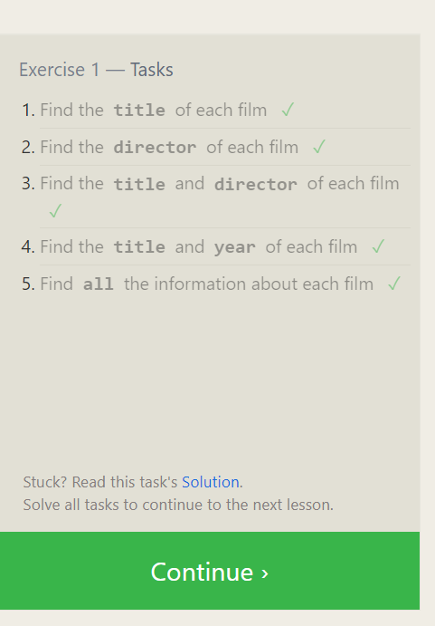

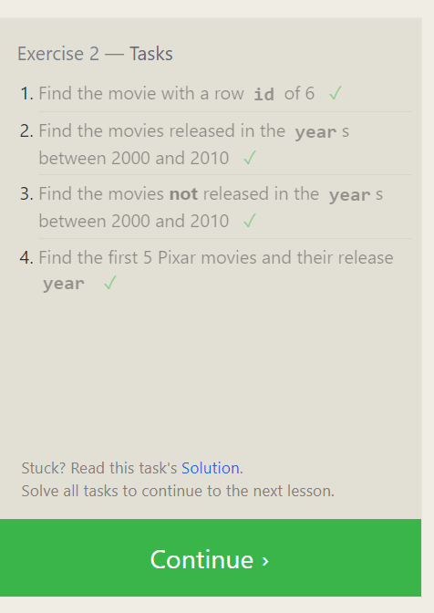

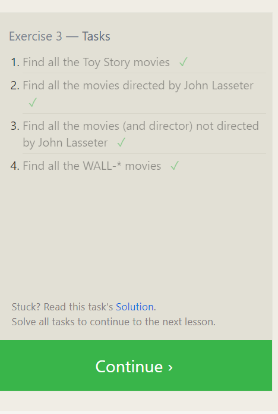

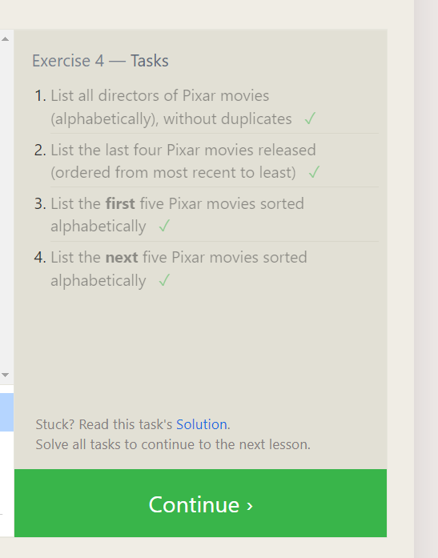

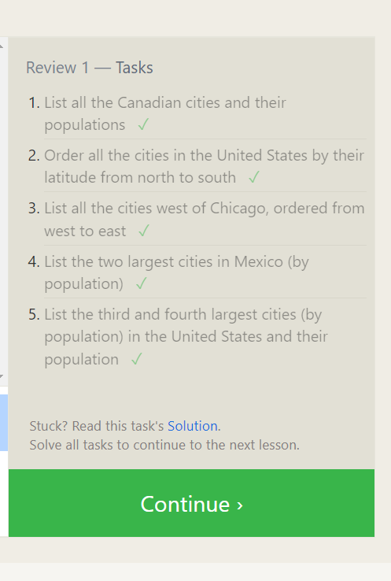

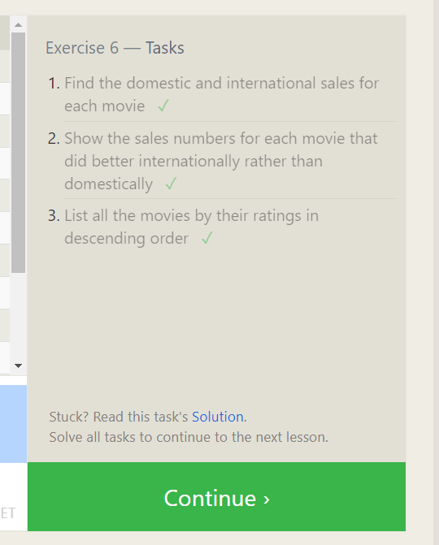

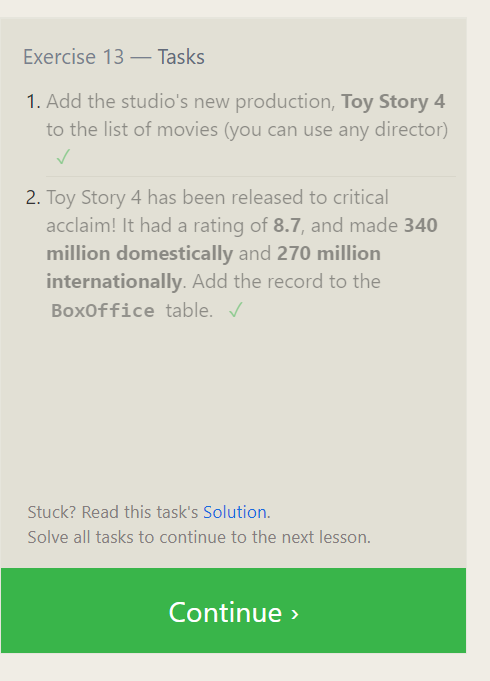

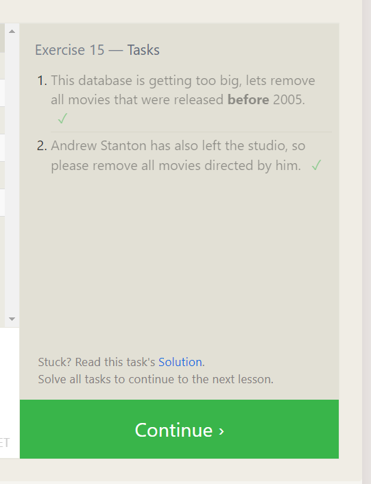

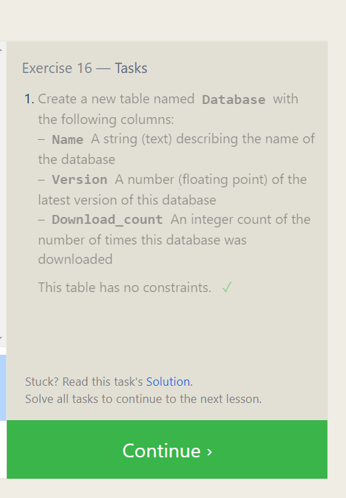

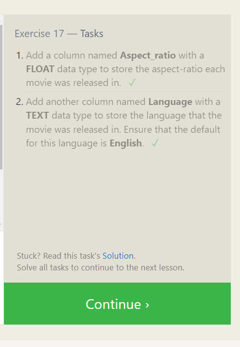

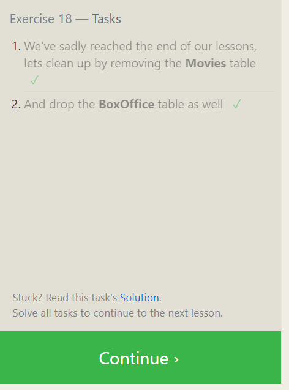

#Terminal

learned some new commands :

pwd - > Where am I in the system.
file [path]
mkdir -> Create a directory
rmkdir -> remove a directory
touch -> create a file
head-> Show the first n lines.
tail-> Show the last n lines.
CTRL + C -> stop running
. -> ref for the current file 