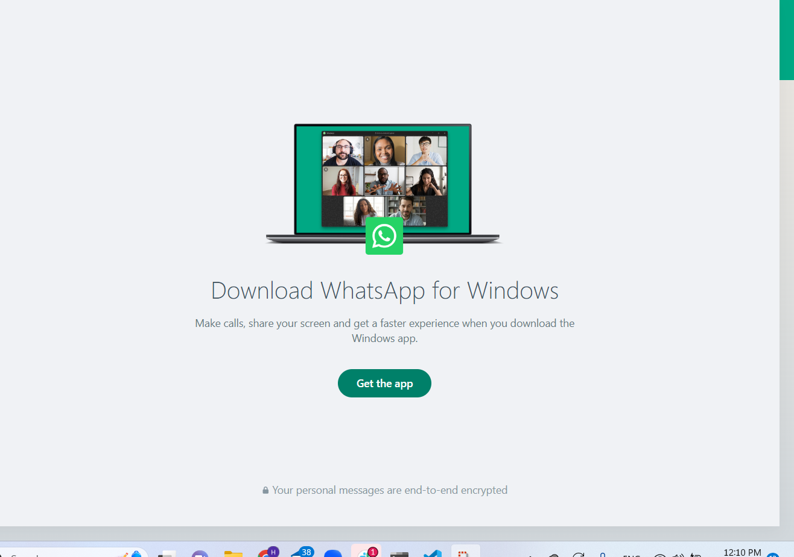

# Reading Class 28

1- What makes a RecyclerView dynamic?

-  RecyclerView is dynamic because it offers the tools and capabilities to manage and display changing data in a flexible, memory-efficient, and visually appealing manner. It is a fundamental component for building dynamic lists and grids in Android applications.

2- Share a screenshot of a recycler view in an application you use!

- Social Media apps, and texting
like whatsApp, facebook,twitter,ex...

